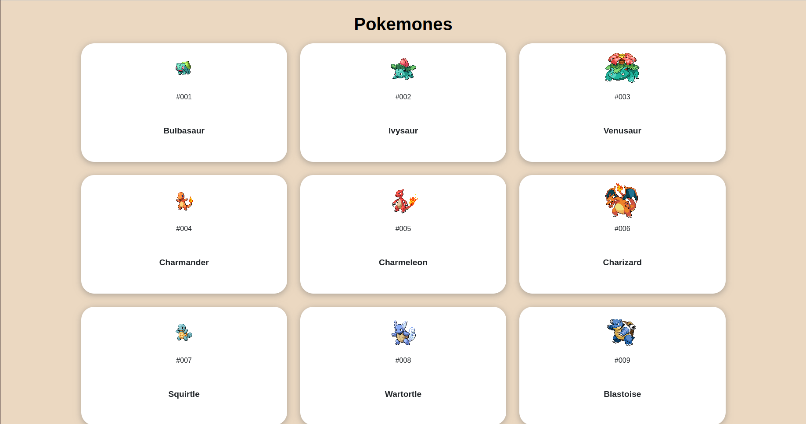
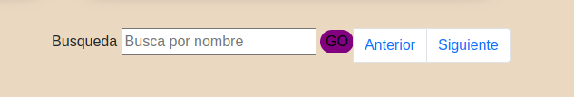
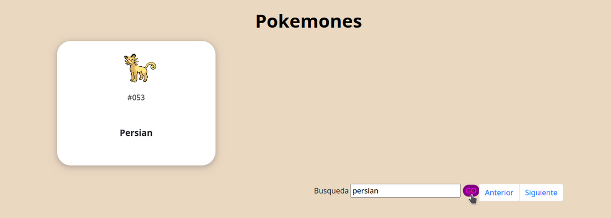
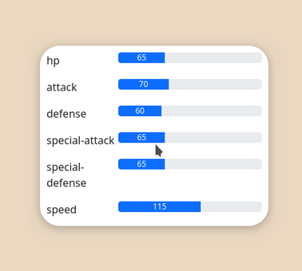
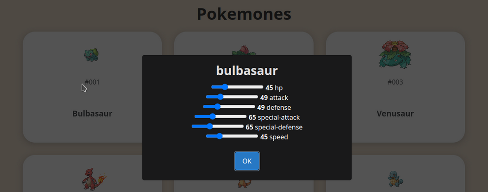

# Pokédex Web App

> Para buscar el Pokemón que escribiste: Debes dar click en GO

> Al pararte sobre cada tarjeta girará y te mostrará:

> Si das click en el reverso o frente de la tarjeta:

Este es un proyecto de Pokédex web que te permite explorar y buscar información sobre diferentes Pokémon. Puedes ver los detalles de cada Pokémon, incluyendo su nombre, número en la Pokédex, estadísticas y más.

## Características

- Lista de Pokémon con imágenes y nombres.
- Detalles de cada Pokémon, incluyendo estadísticas.
- Búsqueda de Pokémon por nombre.
- Paginación para explorar una lista más extensa de Pokémon.

## Tecnologías Utilizadas

- HTML5
- CSS3
- JavaScript (ES6+)
- Bootstrap 5
- SweetAlert2 para las ventanas modales de detalles.

## Cómo Usar

1. Clona este repositorio en tu máquina local.
2. Abre el archivo `index.html` en tu navegador web.
3. Explora la lista de Pokémon, busca por nombre y disfruta de los detalles.

## Contribuir

¡Siéntete libre de contribuir a este proyecto! Puedes abrir problemas (issues) o enviar solicitudes de extracción (pull requests) para mejorar o agregar nuevas características.

## Créditos

Este proyecto utiliza la [PokeAPI](https://pokeapi.co/) para obtener los datos de los Pokémon.

## Autor

[VioletaVillamizar]
